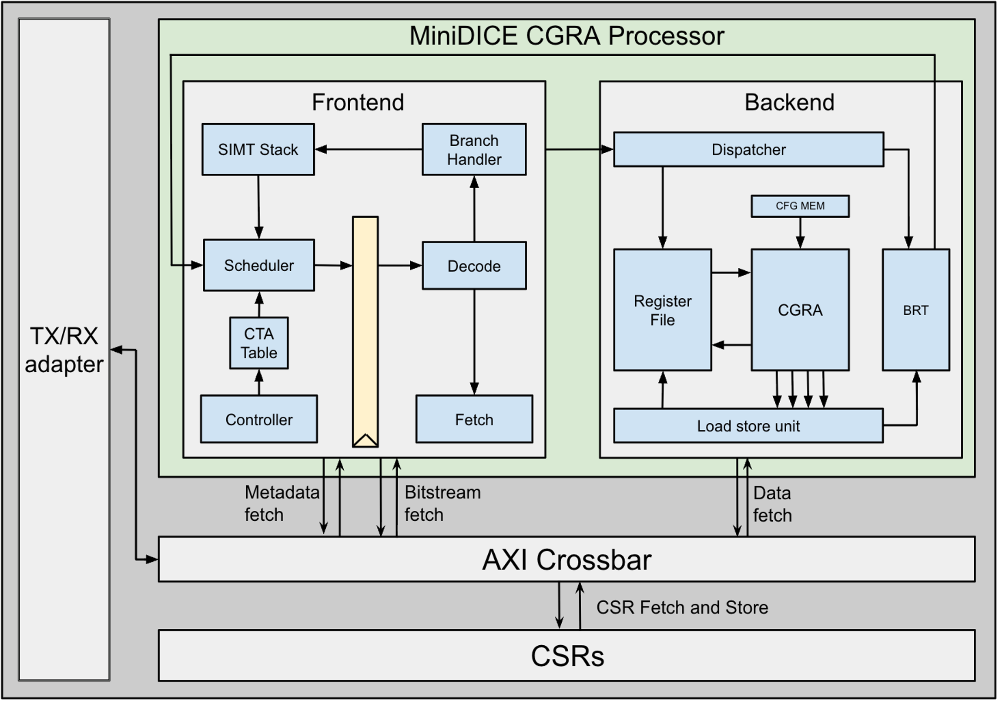

# MiniDICE

**MiniDICE** is a General-Purpose Dataflow Intelligent Compute Engine developed as part of the University of Washington EE478 VLSI capstone.

MiniDICE combines a GPU-style **single-instruction, multiple-thread (SIMT)** execution model with a **4×4 coarse-grained reconfigurable array (CGRA)**. The design supports up to 16 threads and maps computation spatially across 16 processing elements.

Unlike a traditional SIMD backend, intermediate values can move directly between processing elements instead of repeatedly passing through a large centralized register file. MiniDICE explores how GPU-like programmability can be combined with a more dataflow-oriented and energy-efficient compute fabric.

The design was implemented in SystemVerilog, validated through FPGA prototyping, and taken through a complete RTL-to-GDS ASIC flow in the **TSMC 180 nm** process.

---

## Key Features

- GPU-style SIMT execution
- Up to 16 threads per CTA
- 4×4 CGRA with 16 processing elements
- Direct processing-element-to-processing-element communication
- Support for branches and thread divergence
- Double-buffered CGRA configuration memory
- Four load/store interfaces
- AXI4-based system communication
- FPGA prototyping and validation
- Complete RTL-to-GDS ASIC implementation

---

## Architecture

<p align="center">
  
</p>

<p align="center">
  <em>Overview of the MiniDICE processor architecture.</em>
</p>

MiniDICE consists of a **SIMT frontend**, a **CGRA backend**, an **AXI crossbar**, a set of **control and status registers**, and a **TX/RX adapter** for communication with an external FPGA host.

### SIMT Frontend

The frontend manages program control and thread scheduling. Its main components include:

- CTA controller and CTA table
- SIMT stack
- Scheduler
- Metadata and bitstream fetch logic
- Decode stage
- Branch handler

The SIMT stack tracks active threads and supports branch divergence and reconvergence. The scheduler selects the next executable program region, while the fetch and decode stages retrieve the metadata and CGRA configuration required for execution.

### CGRA Backend

The backend performs computation using the 4×4 CGRA. Its main components include:

- Thread dispatcher
- Register file
- Configuration memory
- 4×4 CGRA
- Load/store unit
- Block retirement table

The dispatcher sends active threads into the backend. The register file stores architectural thread state, while intermediate values can move directly between processing elements inside the CGRA. The block retirement table tracks execution and memory operations until they are complete.

---

## Execution Flow

MiniDICE divides a kernel into statically scheduled regions called **p-graphs**. Each p-graph contains the metadata and CGRA configuration required to execute part of a program.

A kernel follows this general process:

1. The FPGA host launches a CTA.
2. The frontend selects the next p-graph.
3. Program metadata and the corresponding CGRA configuration are fetched.
4. Active threads are dispatched to the CGRA backend.
5. Operations execute spatially across the processing elements.
6. Load, store, and register operations complete.
7. Branch results are evaluated and the next p-graph is selected.
8. Execution continues until the kernel finishes.

Double-buffered configuration memory allows a future CGRA configuration to be loaded while the current configuration is executing.

---

## I/O and AXI Crossbar Interface

MiniDICE communicates with an external FPGA host through a credit-based `bsg_link` interface. The TX/RX adapter converts traffic between the physical link and the internal AXI network.

The I/O subsystem is responsible for:

- Receiving commands and data from the FPGA host
- Converting link traffic into AXI transactions
- Returning read data and status information
- Applying credit-based flow control
- Connecting the external host to the MiniDICE processor

The AXI crossbar routes transactions between:

- The TX/RX adapter
- Control and status registers
- Metadata fetch logic
- CGRA bitstream fetch logic
- The backend load/store unit
- FPGA-backed program and data memory

The frontend uses the AXI network to fetch p-graph metadata and CGRA configurations. The backend uses the same network to issue application load and store requests.

The control and status register interface allows the FPGA host to:

- Reset the CGRA core
- Set the starting program counter
- Configure the number of threads
- Provide kernel arguments
- Start kernel execution
- Check busy and completion status
- Read error and execution information

---

## FPGA Prototyping

MiniDICE was also validated using an FPGA host environment.

The FPGA prototype was used to test:

- Host-to-accelerator communication
- AXI crossbar transaction routing
- Program and configuration loading
- Control and status register access
- Kernel launch
- Memory requests and responses
- Completion reporting
- End-to-end workload execution

The FPGA communicates with MiniDICE through the `bsg_link` interface and can also be used to communicate with the fabricated ASIC.

---

## ASIC Implementation

MiniDICE was taken through a complete RTL-to-GDS flow targeting the **TSMC 180 nm** process.

The implementation flow included:

- RTL synthesis
- Formal equivalence checking
- Floorplanning
- Placement and routing
- Static timing analysis
- Design-rule checking
- Layout-versus-schematic verification
- Final GDS generation

### Tools

| Stage | Tool |
|---|---|
| Synthesis | Cadence Genus |
| Formal verification | Cadence Conformal |
| Place and route | Cadence Innovus |
| Static timing analysis | Cadence Tempus |
| DRC and LVS | Siemens Calibre |

---

## Implementation Results

| Metric | Result |
|---|---:|
| Process technology | TSMC 180 nm |
| Operating frequency | 51 MHz |
| Power | 137.85 mW |
| Die area | 2.27 mm² |
| Core area | 1.75 mm² |
| Placement utilization | 77% |
| Standard-cell count | 76,669 |
| Estimated transistor count | 278,850 |
| Minimum setup slack | 0.362 ns |
| Minimum hold slack | 0.030 ns |

The final design completed synthesis, placement and routing, timing analysis, formal verification, DRC, and LVS with positive timing slack.

---

## Repository Structure

```text
Mini_Dice/
├── cad/                    # ASIC flow configuration
├── dora/                   # CGRA generation and mapping
├── rtl/
│   ├── IO/                 # bsg_link and AXI interface logic
│   ├── axi_crossbar/       # AXI transaction routing
│   ├── cgra_core/
│   │   ├── FE/             # SIMT frontend
│   │   ├── BE/             # CGRA backend
│   │   └── dice_core.sv
│   ├── cta_dispatcher/
│   ├── includes/
│   ├── interfaces/
│   ├── mini_dice_top/
│   └── chip_top.sv
├── tb/                     # Testbenches and test vectors
├── MiniDICE_Architecture.png
├── source_me.sh
├── verible.filelist
└── .gitmodules
```

---

## Contributors

- Aadithya Manoj
- Albert Ton
- Elliot Norman
- Juwon Jun
- Patrick Howe
- Sibo Zhang

---

## Acknowledgments

This project was completed through the University of Washington Department of Electrical & Computer Engineering.

We thank:

- Professor Ang Li
- Jiayi Wang
- University of Washington PNCEL
- TSMC
- Apple

---

## Reference

Jiayi Wang, Ang Da Lu, Zhichen Zeng, and Ang Li,  
**“DICE: Enabling Efficient General-Purpose SIMT Execution with Statically Scheduled Coarse-Grained Reconfigurable Arrays.”**  
ISCA 2026.

[Read the DICE paper on arXiv](https://arxiv.org/abs/2605.05496)
