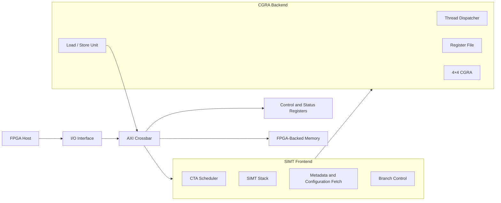
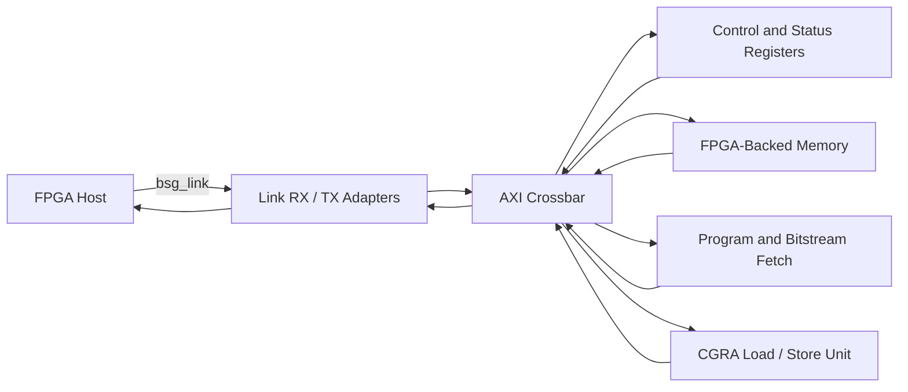

````markdown
# MiniDICE

**MiniDICE** is a General-Purpose Dataflow Intelligent Compute Engine developed as part of the University of Washington EE478 VLSI capstone.

The project combines a GPU-style **SIMT execution model** with a **4×4 coarse-grained reconfigurable array (CGRA)**. MiniDICE supports up to 16 threads and maps computation spatially across 16 processing elements.

Unlike a traditional SIMD backend, intermediate values can move directly between processing elements instead of repeatedly passing through a large centralized register file. This allows MiniDICE to explore a more dataflow-oriented and energy-efficient approach to general-purpose parallel computing.

The design was implemented in SystemVerilog, validated through FPGA prototyping, and taken through a complete ASIC flow in the **TSMC 180 nm** process.

---

## Key Features

- GPU-style SIMT execution
- Up to 16 threads per CTA
- 4×4 CGRA with 16 processing elements
- Spatial execution and direct PE-to-PE communication
- Support for branches and thread divergence
- Double-buffered CGRA configuration memory
- Four load/store interfaces
- AXI4-based communication
- FPGA prototyping and validation
- Complete RTL-to-GDS ASIC implementation

---

## Architecture



The MiniDICE architecture contains two main compute sections: the SIMT frontend and the CGRA backend. An AXI crossbar connects the processor, control registers, host interface, and FPGA-backed memory.

### SIMT Frontend

The frontend manages:

- CTA scheduling
- Active-thread masks
- Branch divergence and reconvergence
- Program metadata
- CGRA configuration loading
- Thread execution control

### CGRA Backend

The backend contains:

- A thread dispatcher
- Per-thread architectural registers
- A 4×4 array of processing elements
- Direct communication between neighboring processing elements
- Four load/store interfaces
- Execution and memory completion tracking

---

## Execution Flow

MiniDICE divides a kernel into statically scheduled regions called **p-graphs**. Each p-graph contains the metadata and configuration required to execute part of a program on the CGRA.

A kernel follows this general process:

1. The FPGA host launches a CTA.
2. The frontend selects the next p-graph.
3. Program metadata and the CGRA configuration are loaded.
4. Active threads are dispatched to the CGRA.
5. Operations execute spatially across the processing elements.
6. Loads, stores, and register updates complete.
7. The frontend evaluates branch results and selects the next p-graph.
8. Execution continues until the kernel finishes.

Double-buffered configuration memory allows one CGRA configuration to execute while another is being prepared.

---

## I/O and Crossbar Interface

MiniDICE communicates with an FPGA host through a credit-based `bsg_link` interface. The physical interface transfers data between the FPGA and the ASIC, while internal adapters convert the link traffic into AXI transactions.

The I/O subsystem is responsible for:

- Receiving commands and data from the FPGA host
- Converting serialized link traffic into AXI requests
- Returning read data and status information to the FPGA
- Applying credit-based flow control
- Connecting the external host interface to the internal AXI network

The AXI crossbar routes transactions between the main system components:

- FPGA-backed program and data memory
- MiniDICE control and status registers
- CGRA configuration memory
- Program metadata fetch logic
- Load/store interfaces in the CGRA backend



The control and status register interface allows the FPGA host to:

- Reset the CGRA core
- Provide the starting program counter
- Configure the number of threads
- Pass kernel arguments
- Start kernel execution
- Check busy and completion status
- Read error and execution information

The same AXI network is used by the frontend to fetch p-graph metadata and CGRA configurations and by the backend to issue application load and store requests.

---

## FPGA Prototyping

MiniDICE was prototyped using an FPGA host environment.

The FPGA prototype was used to validate:

- Host-to-accelerator communication
- AXI crossbar transaction routing
- Program and configuration loading
- CSR reads and writes
- Kernel launch
- Memory requests and responses
- Completion reporting
- End-to-end workload execution

The FPGA communicates with MiniDICE through the `bsg_link` interface. The FPGA platform can also be used to communicate with and test the fabricated ASIC.

---

## ASIC Implementation

MiniDICE was taken through a complete RTL-to-GDS flow targeting the **TSMC 180 nm** process.

The implementation flow included:

- RTL synthesis
- Formal equivalence checking
- Floorplanning
- Placement and routing
- Static timing analysis
- Design-rule checking
- Layout-versus-schematic verification
- Final GDS generation

### Tools

| Stage | Tool |
|---|---|
| Synthesis | Cadence Genus |
| Formal verification | Cadence Conformal |
| Place and route | Cadence Innovus |
| Static timing analysis | Cadence Tempus |
| DRC and LVS | Siemens Calibre |

---

## Implementation Results

| Metric | Result |
|---|---:|
| Process technology | TSMC 180 nm |
| Operating frequency | 51 MHz |
| Power | 137.85 mW |
| Die area | 2.27 mm² |
| Core area | 1.75 mm² |
| Placement utilization | 77% |
| Standard-cell count | 76,669 |
| Estimated transistor count | 278,850 |
| Minimum setup slack | 0.362 ns |
| Minimum hold slack | 0.030 ns |

The final design completed synthesis, place and route, timing analysis, formal verification, DRC, and LVS with positive timing slack.

---

## Repository Structure

```text
Mini_Dice/
├── cad/                    # ASIC flow configuration
├── rtl/
│   ├── IO/                 # bsg_link and AXI interface logic
│   ├── axi_crossbar/       # AXI transaction routing
│   ├── cgra_core/
│   │   ├── FE/             # SIMT frontend
│   │   ├── BE/             # CGRA backend
│   │   └── dice_core.sv
│   ├── cta_dispatcher/
│   ├── includes/
│   ├── interfaces/
│   ├── mini_dice_top/
│   └── chip_top.sv
├── tb/                     # Testbenches and test vectors
├── dora/                   # CGRA generation and mapping
├── source_me.sh
├── verible.filelist
└── .gitmodules
```

---

## Contributors

- Aadithya Manoj
- Albert Ton
- Elliot Norman
- Juwon Jun
- Patrick Howe
- Sibo Zhang

---

## Acknowledgments

This project was completed through the University of Washington Department of Electrical & Computer Engineering.

We thank:

- Professor Ang Li
- Jiayi Wang
- University of Washington PNCEL
- TSMC
- Apple

---

## Reference

Jiayi Wang, Ang Da Lu, Zhichen Zeng, and Ang Li,  
**“DICE: Enabling Efficient General-Purpose SIMT Execution with Statically Scheduled Coarse-Grained Reconfigurable Arrays.”**  
ISCA 2026.

## Repository

https://github.com/aadithyamanoj/Mini_Dice
````
